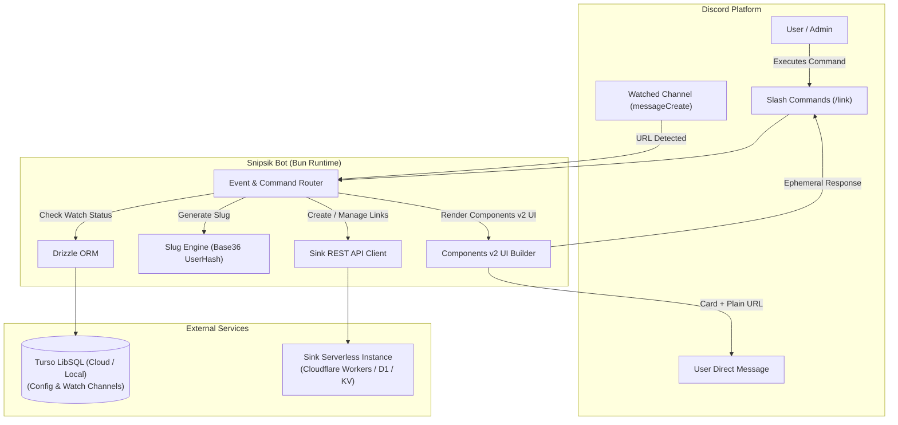

# Snipsik 아키텍처 및 배포 가이드 (Architecture & Deployment)

## 1. 시스템 구성도



---

## 2. 프로젝트 디렉토리 구조

모든 소스 코드는 `src/`에 위치하며, 절대 경로 별칭(`@/*`)을 사용합니다.

```
Snipsik/
├── Dockerfile                  # oven/bun Multi-stage Dockerfile
├── docker-compose.yml          # Docker Compose 배포 설정
├── .dockerignore
├── .env.example                # 환경 변수 템플릿
├── drizzle.config.ts           # Drizzle Kit 설정 (Turso/LibSQL)
├── package.json                # Bun 패키지 정의 및 스크립트
├── tsconfig.json               # strict: true, paths: {"@/*": ["src/*"]}
├── docs/                       # 전체 문서
│   ├── README.md               # 문서 인덱스
│   ├── SPECIFICATION.md        # 기능 및 명령어 상세 사양서
│   ├── ARCHITECTURE.md         # 시스템 아키텍처 및 배포 가이드
│   ├── adr/                    # 아키텍처 결정 기록
│   ├── reviews/                # 코드베이스 리뷰 기록
│   └── 05-qa/                  # 패치별 QA 보고서
├── scripts/
│   └── migrate-pg-to-turso.ts  # PostgreSQL -> Turso LibSQL 마이그레이션 도구
└── src/
    ├── index.ts                # 봇 초기화 및 클라이언트 로그인 진입점
    ├── config.ts               # Zod 기반 strict 환경변수 파싱 및 검증
    ├── db/
    │   ├── index.ts            # Drizzle ORM Turso (LibSQL) 클라이언트 연결
    │   └── schema.ts           # Config 및 Watch Channels 테이블 스키마 (SQLite/LibSQL)
    ├── types/
    │   ├── sink.ts             # Sink API 엄격한 TypeScript 인터페이스
    │   └── bot.ts              # Command, Modal, Button, Component 타입 정의
    ├── services/
    │   ├── cacheReadiness.ts   # 캐시 준비 상태 진단 (uninitialized, loading, ready, degraded)
    │   ├── cacheRecovery.ts    # DB 연결 장애 시 지수 백오프 기반 캐시 복구 루프
    │   ├── dashboardLinkSnapshot.ts # 대시보드 링크 상세 모달 입력값 스냅샷 관리 (유실 방지)
    │   ├── guildConfigService.ts    # 서버별 자동 단축/최소 길이/제외 도메인 설정 캐시/CRUD/OCC
    │   ├── sinkClient.ts       # Sink REST API 통신 클라이언트 (Fetch 기반 타임아웃 및 계약 검증)
    │   ├── slugManager.ts      # Slug 생성, Base36 유저 해시 인코딩, 커스텀 슬러그 권한 검증기
    │   ├── userConfigService.ts# 유저별 감시 오버라이드 및 DM 포맷 설정 캐시/CRUD/OCC
    │   └── watchService.ts     # Drizzle ORM 기반 Watch 채널 캐시 및 CRUD
    ├── events/
    │   ├── ready.ts            # 봇 구동, 슬래시 커맨드 등록 및 캐시 초기화
    │   ├── interactionCreate.ts# 슬래시 커맨드, 모달, 버튼, 셀렉트 메뉴, Autocomplete 라우터
    │   ├── messageCreate.ts    # URL 감지 -> 도메인/유저 필터링 -> 자동 단축/fixupx -> 본문 치환 DM 발송
    │   ├── channelDelete.ts    # 감시 대상 채널 삭제 감지 시 Watch 목록 자동 정리
    │   └── threadDelete.ts     # 감시 대상 스레드 삭제 감지 시 Watch 목록 자동 정리
    ├── commands/
    │   └── link.ts             # /link [dashboard|config|create|custom|list|stats|delete|check]
    └── utils/
        ├── domain.ts           # 제외 도메인 파싱, 정규화 및 서브도메인 매칭 유틸리티
        ├── logger.ts           # 콘솔 컬러 로거
        ├── modals.ts           # 링크 생성/수정용 Discord Modal 빌더
        ├── mutex.ts            # KeyedMutex (길드/유저 단위 단일 프로세스 비동기 락)
        ├── safeHttp.ts         # SSRF 방지 및 안전한 HTTP 요청 클라이언트 (사설망 차단, 타임아웃)
        ├── tags.ts             # 쉼표 구분 태그 파싱, 정규화, 중복 제거 유틸리티
        ├── time.ts             # 상대 기간/ISO 만료일 엄격 파싱 및 검증 유틸리티
        ├── twitter.ts          # Twitter/X 상태 링크 감지 및 fixupx.com 자동 변환 유틸리티
        └── ui.ts               # 100% Components v2 기반 메시지 레이아웃 빌더
```

---

## 3. 환경 변수 레퍼런스 (`.env`)

| 환경 변수명                   | 필수 여부 |         기본값         | 설명                                                                               |
| :---------------------------- | :-------: | :--------------------: | :--------------------------------------------------------------------------------- |
| `DISCORD_TOKEN`               | **필수**  |           -            | 디스코드 봇 토큰                                                                   |
| `DISCORD_CLIENT_ID`           | **필수**  |           -            | 디스코드 봇 애플리케이션 ID                                                        |
| `DATABASE_URL`                | **필수**  |           -            | Turso LibSQL 연결 문자열 (`libsql://...`, `https://...`, `file:...`)               |
| `DATABASE_AUTH_TOKEN`         |   선택    |           -            | Turso 클라우드 데이터베이스 인증 토큰 (원격 Turso 연결 시 필수)                    |
| `SINK_BASE_URL`               | **필수**  | `https://s.japsik.com` | 배포된 Sink 인스턴스 도메인 주소                                                   |
| `SINK_API_TOKEN`              | **필수**  |           -            | Sink 인스턴스의 `NUXT_SITE_TOKEN` (API Bearer 인증용)                              |
| `SINK_REQUEST_TIMEOUT_MS`     |   선택    |        `10000`         | Sink API 헤더·본문 전체 요청 시간 제한 (1,000~60,000ms)                            |
| `RANDOM_SLUG_LENGTH`          |   선택    |          `3`           | 일반 링크 생성 시 앞자리 랜덤 문자열 길이 (2~16)                                   |
| `ADMIN_USER_IDS`              |   선택    |          `""`          | `/link custom` 생성이 허용된 디스코드 유저 ID (콤마 구분)                          |
| `AUTO_SHORTEN_MIN_URL_LENGTH` |   선택    |          `70`          | URL 자동 단축의 전역 최소 길이 기본값 (0: 전체 단축, 1~2048)                       |
| `IGNORED_DOMAINS`             |   선택    |          `""`          | URL 자동 단축에서 전역으로 제외할 도메인 목록 (콤마 구분, 예: tenor.com,giphy.com) |

---

## 4. 데이터베이스 스키마 및 보안 아키텍처 (Database & Security)

### 4.1 데이터베이스 스키마 (Drizzle ORM & LibSQL)

```typescript
// watch_channels 테이블 (감시 대상 채널)
export const watchChannels = sqliteTable("watch_channels", {
  id: integer("id").primaryKey({ autoIncrement: true }),
  guildId: text("guild_id").notNull(),
  channelId: text("channel_id").notNull(),
  createdBy: text("created_by").notNull(),
  createdAt: integer("created_at", { mode: "timestamp_ms" })
    .default(sql`(unixepoch() * 1000)`)
    .notNull(),
});

// guild_configs 테이블 (서버별 부가 설정)
export const guildConfigs = sqliteTable(
  "guild_configs",
  {
    guildId: text("guild_id").primaryKey(),
    autoShortenEnabled: integer("auto_shorten_enabled", { mode: "boolean" })
      .default(true)
      .notNull(),
    autoShortenMinUrlLength: integer("auto_shorten_min_url_length"),
    ignoredDomains: text("ignored_domains", { mode: "json" })
      .$type<string[]>()
      .default([])
      .notNull(),
    version: integer("version").default(1).notNull(),
    createdAt: integer("created_at", { mode: "timestamp_ms" })
      .default(sql`(unixepoch() * 1000)`)
      .notNull(),
    updatedAt: integer("updated_at", { mode: "timestamp_ms" })
      .default(sql`(unixepoch() * 1000)`)
      .$onUpdateFn(() => new Date())
      .notNull(),
  },
  (table) => [
    check(
      "guild_configs_min_url_len_check",
      sql`${table.autoShortenMinUrlLength} >= 0 AND ${table.autoShortenMinUrlLength} <= 2048`,
    ),
  ],
);

// user_configs 테이블 (유저별 감시 오버라이드, DM 포맷 및 트위터 fixupx 설정)
export const userConfigs = sqliteTable(
  "user_configs",
  {
    userId: text("user_id").primaryKey(),
    autoDmMode: text("auto_dm_mode").default("inherit").notNull(), // 'inherit' | 'on' | 'off'
    dmFormat: text("dm_format").default("replace").notNull(), // 'replace' | 'list'
    autoShortenMinUrlLength: integer("auto_shorten_min_url_length"), // nullable, null: 상위 기본값 상속
    ignoredDomains: text("ignored_domains", { mode: "json" })
      .$type<string[]>()
      .default([])
      .notNull(),
    fixupxEnabled: integer("fixupx_enabled", { mode: "boolean" })
      .default(true)
      .notNull(),
    version: integer("version").default(1).notNull(),
    createdAt: integer("created_at", { mode: "timestamp_ms" })
      .default(sql`(unixepoch() * 1000)`)
      .notNull(),
    updatedAt: integer("updated_at", { mode: "timestamp_ms" })
      .default(sql`(unixepoch() * 1000)`)
      .$onUpdateFn(() => new Date())
      .notNull(),
  },
  (table) => [
    check(
      "user_configs_min_url_len_check",
      sql`${table.autoShortenMinUrlLength} >= 0 AND ${table.autoShortenMinUrlLength} <= 2048`,
    ),
  ],
);
```

### 4.2 데이터베이스 보안 모델 및 동시성 제어 (Database Access, Security & Concurrency)

- **Direct Backend Connection Only**:
  - Snipsik은 별도의 웹/모바일 프론트엔드 클라이언트가 없는 단독 백엔드 서비스입니다.
  - 모든 DB 조작은 봇 프로세스 내부에서 환경변수(`DATABASE_URL`, `DATABASE_AUTH_TOKEN`)를 통한 Turso LibSQL 드라이버(`@libsql/client`) 직접 연결로만 수행됩니다.
- **토큰 기반 인증 및 접근 제어 (Token-based Auth)**:
  - Turso 원격 데이터베이스 연결은 Bearer 인증 토큰을 통해 보호되며, 불필요한 관리 포트나 Data API가 외부에 노출되지 않습니다.
- **단일 프로세스 격리 및 동시성 제어 (KeyedMutex & Optimistic Concurrency Control)**:
  - SQLite/LibSQL 환경은 분산 트랜잭션의 `SELECT ... FOR UPDATE` 행 레벨 락을 지원하지 않습니다.
  - Snipsik은 단일 프로세스 봇 배포 모델에 맞추어 다음 2단계 동시성 보호를 구현합니다:
    1. **1차 인메모리 직렬화 (`KeyedMutex`)**: 동일 길드(`guildId`) 또는 동일 유저(`userId`)에 대한 동시 설정 변경 작업을 프로세스 내부에서 뮤텍스로 큐잉하여 원자적으로 순차 실행합니다.
    2. **2차 낙관적 동시성 제어 (OCC)**: `version` 단조 증가 카운터 컬럼을 활용하여 업데이트 시 `WHERE version = :currentVersion` 조건을 검증하며, 버전 불일치 발생 시 최신 데이터를 재조회하여 최대 3회 자동 재시도합니다.
- **외부 요청 보안 (SSRF Mitigation & Request Safety)**:
  - 임의의 외부 대상 URL을 검사하는 `/link check` 요청 시 `safeHttp`(`safeHttpGet`) 유틸리티를 적용하여 사설 IP 대역(RFC 1918, RFC 4193, 루프백, 링크 로컬 등)으로의 요청을 차단하고, DNS Rebinding 및 비정상 리다이렉트를 방지합니다.
  - Sink 인스턴스와의 REST API 통신 시에는 `SINK_REQUEST_TIMEOUT_MS`에 따른 헤더/본문 타임아웃 제한 및 엄격한 응답 계약 검증을 적용합니다.
- **회복 탄력적 캐시 복구 (Resilient Cache Recovery)**:
  - 봇 구동 시 DB 일시 장애가 발생하더라도 프로세스가 크래시되지 않고 지수 백오프(1초, 2초, 4초, 8초, 16초, 최대 30초) 기반의 비동기 복구 루프(`cacheRecovery.ts`)로 전환되며, 복구 전까지 안전한 Fail-closed 정책 및 직전 유효 스냅샷을 유지합니다.

---

## 5. Docker 배포 가이드

### 5.1 Dockerfile (`oven/bun:1-alpine`)

Multi-stage 빌드를 통해 이미지 용량을 최소화하고 보안을 위해 `bun` 비루트 사용자로 구동합니다.

```dockerfile
# Build Stage
FROM oven/bun:1-alpine AS builder
WORKDIR /app
COPY package.json bun.lock* ./
RUN bun install --frozen-lockfile
COPY tsconfig.json ./
COPY src/ ./src/
RUN bun build src/index.ts --outdir dist --target bun

# Production Stage
FROM oven/bun:1-alpine AS runner
WORKDIR /app
ENV NODE_ENV=production
COPY package.json bun.lock* ./
RUN bun install --production --frozen-lockfile
COPY --from=builder /app/dist ./dist
USER bun
CMD ["bun", "run", "dist/index.js"]
```

### 5.2 실행 방법

1. `.env` 파일 생성 및 환경 변수 설정
2. DB 스키마 푸시:
   ```bash
   bun run db:push
   ```
3. Docker Compose 빌드 및 백그라운드 실행:
   ```bash
   docker compose up -d --build
   ```
4. 로그 확인:
   ```bash
   docker compose logs -f snipsik
   ```
